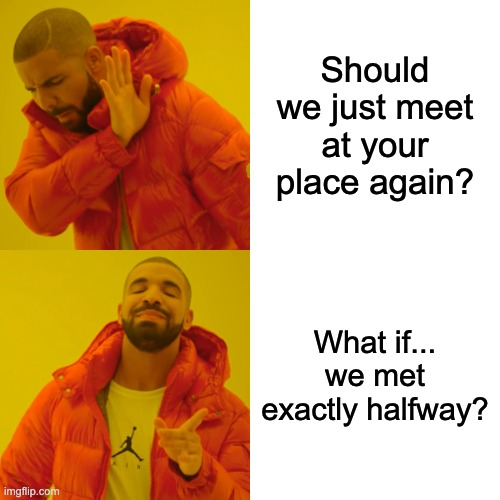

# Meet Me Halfway ☕️🗺️

> "When you and your friend both say 'let's meet in the middle' but neither of you knows where the middle is..."

Welcome to **Meet Me Halfway**! This is the Python project that finally answers the age-old question: _"Where should we meet for coffee so it's fair for both of us?"_ (Because, let's be honest, nobody wants to drive across the city while the other just walks downstairs.)



## What Does This Do?

- Takes two addresses (yours and your friend's, nemesis, or that person who still owes you $5).
- Uses the power of **MCP** (Model Context Protocol) to talk to Google Maps like a boss.
- Finds the geographic midpoint between you two (no, not the center of the Earth).
- Searches for the best-rated coffee shop near that midpoint.
- Gives you directions from both starting points, so you can see who got the short end of the stick.

## How Does It Work? (a.k.a. "The Technical Stuff")

1. **Configuration**: You put your two addresses in `locations_config.json` and your Google Maps API key in `maps_api_key.json` (which is totally secret and gitignored, so hackers can't steal your coffee plans).
2. **MCP Magic**: The script uses the [Model Context Protocol](https://github.com/modelcontextprotocol) to spin up a Google Maps server via Node.js. Python talks to it using `mcp.client.stdio` and `ClientSession`.
3. **Geocoding**: Both addresses are geocoded (turned into latitude/longitude, not into secret codes).
4. **Midpoint Calculation**: The script does some quick math (no calculus, promise) to find the halfway point.
5. **Coffee Shop Hunt**: It searches for coffee shops near the midpoint, picks the one with the highest rating (because you deserve the best).
6. **Directions**: It fetches driving directions for both parties, so you can compare travel times and argue about who should pay for coffee.

## How To Use (a.k.a. "Just Tell Me What To Do")

1. Clone this repo. (You know the drill.)
2. Run `npm install -g @modelcontextprotocol/server-google-maps` if you haven't already. (Node.js required!)
3. Create `locations_config.json` like this:

```json
{
  "location1": "1600 Amphitheatre Parkway, Mountain View, CA",
  "location2": "1 Infinite Loop, Cupertino, CA"
} 
```

4. Create `maps_api_key.json` like this:
```json
{
  "GOOGLE_MAPS_API_KEY": "YOUR_SUPER_SECRET_API_KEY"
}
```

5. Run the script:
```bash
python meetmehalfway.py
```

6. Watch the magic happen. ☕️

## Why MCP?

Because talking to Google Maps directly from Python is so 2019. MCP lets you use tools (like Google Maps) as if you were a super-powered AI agent. It's like having a butler who knows how to use Google Maps, but doesn't judge your coffee addiction.

## License

MIT. Use it, fork it, meme it. Just don't blame me if your friend still bails on coffee.